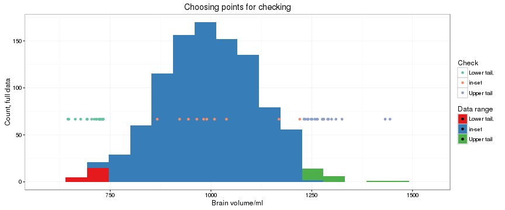
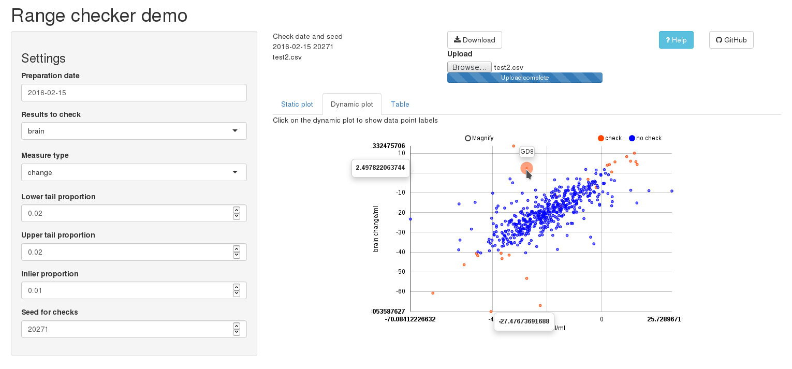

## Need for data checking

> 1. There are an estimated 47 million people worldwide with Alzheimer's disease, expected to increase to 75 million by 2030 http://www.alz.co.uk/research/statistics
> 2. Brain atrophy is a sensitive biomarker for Alzheimer's Disease. 
> 3. The boundary shift integral (BSI) is a robust measure of brain atrophy on serial MRI scans, reliant on semi-automated brain segmentation and automated registration http://www.ncbi.nlm.nih.gov/pmc/articles/PMC2828361/
> 4. To apply to large numbers of scans (for example in a clinical trial) it is necessary to find a way to assure data quality by
identifying potential outliers and performing random checks on a
blinded dataset.

<ul class="build incremental">
<li class="strong">Range checking</li>
</ul>

---

## Why an app?

* Values to check are selected as the top and bottom 2% and 1% randomly selected from the other points.
* Sorting these out has previously been done by loading the results into a spreadsheet and manually sorting and applying formulas. We want to do this reproducibly and faster.

---

## [Range Checker](https://imalone.shinyapps.io/rangeCheck/)

---

## [Range Checker](https://imalone.shinyapps.io/rangeCheck/)

(We're not done yet, press space.)

> * Allow easy upload of data to be checked and download of points selected.
> * Parameters for selection can be changed on the fly.
> * Per-day and -test seed generation makes it possible to confirm a given selection.
> * RCharts and table display make it simple to investigate wildly incorrect points or spot data-loading problems.
> * GitHub: <a href="https://github.com/imalone/rangeCheck" target="_blank"><i class="fa fa-github fa-2x"></i>https://github.com/imalone/rangeCheck</a>
> * ShinyApp: https://imalone.shinyapps.io/rangeCheck/ (Now we're done.)

Thanks to [RStudio](https://www.rstudio.com/) and [ShinyApps](https://www.shinyapps.io/), the [Data Science Specialisation lecturers](https://github.com/DataScienceSpecialization/courses/), many Coursera students and TAs, [Slidify](http://slidify.org/) and of course, the people behind [<i class="fa fa-fort-awesome"></i>Font Awesome](https://fortawesome.github.io/Font-Awesome/)
